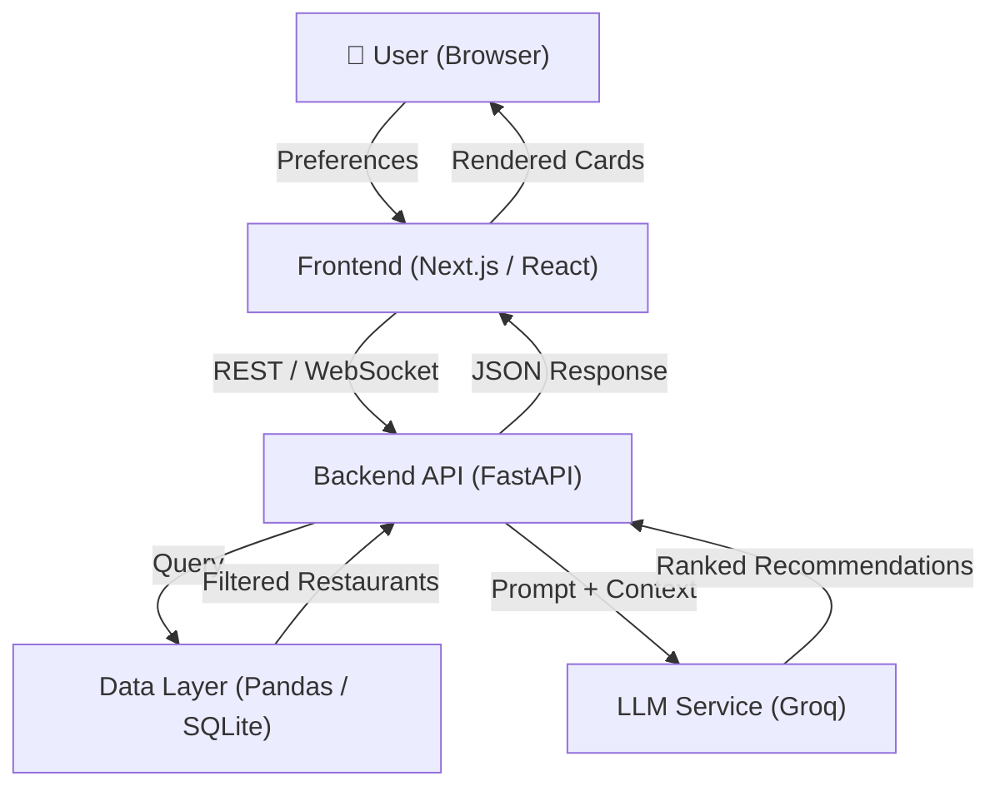
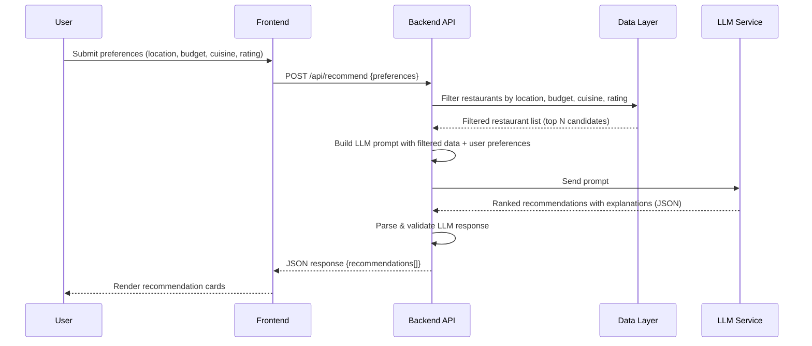
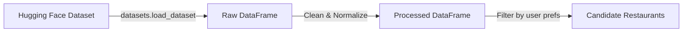
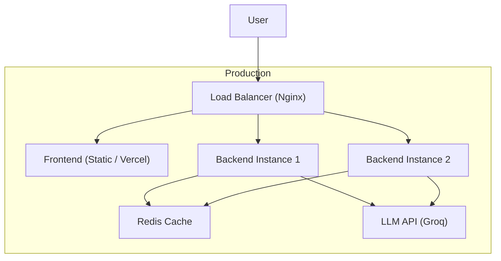

# Architecture — AI-Powered Restaurant Recommendation System

> Derived from [context.md](file:///c:/Users/Gourav/Desktop/Projects/Zomato/Docs/context.md)

---

## 1. High-Level Overview

The system is a three-tier application that combines **structured restaurant data** with a **Large Language Model (LLM)** to deliver personalized, explainable restaurant recommendations through a web-based interface.



---

## 2. Architecture Layers

### 2.1 Presentation Layer — Frontend

| Aspect           | Detail                                              |
| ---------------- | --------------------------------------------------- |
| **Framework**    | Next.js (React) or plain HTML/CSS/JS                |
| **Responsibility** | Collect user preferences, display recommendations |
| **Key Pages**    | Home / Preference Form → Results / Recommendation Cards |
| **Communication** | REST API calls to Backend                          |

**User Input Form Fields:**

| Field                   | Type          | Example Values                         |
| ----------------------- | ------------- | -------------------------------------- |
| Location                | Dropdown/Text | Delhi, Bangalore, Mumbai               |
| Budget                  | Select        | Low (≤₹300), Medium (₹300–₹800), High (₹800+) |
| Cuisine                 | Multi-select  | Italian, Chinese, North Indian, etc.   |
| Minimum Rating          | Slider/Number | 3.0 – 5.0                             |
| Additional Preferences  | Text/Tags     | Family-friendly, Quick service, Rooftop |

---

### 2.2 Application Layer — Backend API

| Aspect           | Detail                                             |
| ---------------- | -------------------------------------------------- |
| **Framework**    | FastAPI (Python)                                   |
| **Responsibility** | Orchestration — filtering, prompt building, LLM calls |
| **Endpoints**    | See §4 API Contract                               |

The backend acts as the **Integration Layer** described in the problem statement. It:

1. Receives user preferences from the frontend
2. Queries the Data Layer to filter matching restaurants
3. Constructs a structured LLM prompt with the filtered data
4. Calls the LLM service and parses the response
5. Returns ranked, explained recommendations to the frontend

---

### 2.3 Data Layer

| Aspect           | Detail                                                        |
| ---------------- | ------------------------------------------------------------- |
| **Source**        | [Zomato Dataset on Hugging Face](https://huggingface.co/datasets/ManikaSaini/zomato-restaurant-recommendation) |
| **Storage**      | CSV → Pandas DataFrame (in-memory) or SQLite for persistence  |
| **Preprocessing** | Clean nulls, normalize cuisine names, bucket costs, parse ratings |

**Core Schema (extracted fields):**

| Column              | Type    | Description                        |
| ------------------- | ------- | ---------------------------------- |
| `restaurant_name`   | string  | Name of the restaurant             |
| `location`          | string  | City / area                        |
| `cuisines`          | string  | Comma-separated cuisine types      |
| `average_cost_for_two` | int  | Cost for two people (₹)           |
| `aggregate_rating`  | float   | Average user rating (0–5)          |
| `votes`             | int     | Number of user votes               |
| `has_online_delivery`| bool   | Online delivery available          |
| `has_table_booking` | bool    | Table booking available            |

---

### 2.4 LLM Service — Recommendation Engine

| Aspect           | Detail                                          |
| ---------------- | ------------------------------------------------ |
| **Provider**     | Groq API (LLaMA 3 / Mixtral via Groq inference)  |
| **Invocation**   | Backend sends a prompt via Groq Python SDK        |
| **Response**     | Structured JSON with ranked restaurants + reasons |

---

## 3. Data Flow — End to End



---

## 4. API Contract

### `POST /api/recommend`

**Request Body:**

```json
{
  "location": "Delhi",
  "budget": "medium",
  "cuisines": ["Italian", "Chinese"],
  "min_rating": 3.5,
  "preferences": "family-friendly, rooftop seating"
}
```

**Response Body:**

```json
{
  "recommendations": [
    {
      "rank": 1,
      "restaurant_name": "Olive Bar & Kitchen",
      "cuisines": "Italian, Mediterranean",
      "location": "Mehrauli, Delhi",
      "aggregate_rating": 4.5,
      "average_cost_for_two": 2500,
      "explanation": "Perfect for a family dinner with a rooftop setting, excellent Italian menu, and consistently high ratings."
    }
  ],
  "summary": "Here are your top 5 Italian and Chinese restaurants in Delhi under a medium budget with great family-friendly vibes.",
  "total_candidates_filtered": 42
}
```

### `GET /api/locations`

Returns the list of distinct locations available in the dataset.

### `GET /api/cuisines`

Returns the list of distinct cuisines available in the dataset.

### `GET /api/health`

Returns service health and LLM connectivity status.

---

## 5. Prompt Engineering Strategy

The prompt sent to the LLM follows a **structured reasoning** approach:

```
You are an expert restaurant recommendation assistant.

## User Preferences
- Location: {location}
- Budget: {budget_label} (≤ ₹{budget_max} for two)
- Preferred Cuisines: {cuisines}
- Minimum Rating: {min_rating}
- Additional: {preferences}

## Candidate Restaurants
{formatted_table_of_filtered_restaurants}

## Instructions
1. Rank the top 5 restaurants that best match the user's preferences.
2. For each restaurant, provide a short, human-friendly explanation of WHY it is a good match.
3. If none of the candidates are a great fit, say so honestly.
4. Return your answer as a JSON array with keys: rank, restaurant_name, cuisines, location, aggregate_rating, average_cost_for_two, explanation.
```

**Design Principles:**
- Provide full context (all candidate data) so the LLM can reason comparatively
- Ask for structured JSON output for reliable parsing
- Include a fallback instruction for edge cases (no good matches)
- Keep the prompt deterministic by setting `temperature = 0.3`

---

## 6. Technology Stack

| Layer              | Technology                  | Rationale                                    |
| ------------------ | --------------------------- | -------------------------------------------- |
| **Frontend**       | Next.js / React             | Modern, component-based UI with SSR support  |
| **Styling**        | Vanilla CSS                 | Full control, no framework lock-in           |
| **Backend**        | Python + FastAPI            | Async-ready, great for ML/data pipelines     |
| **Data Processing**| Pandas                      | Rapid CSV processing and filtering           |
| **Database**       | SQLite (optional)           | Lightweight persistence for preprocessed data|
| **LLM**           | Groq API                    | Ultra-fast LLM inference (LLaMA 3 / Mixtral) |
| **LLM SDK**       | `groq`                      | Official Groq Python SDK                     |
| **Dataset**        | Hugging Face `datasets`     | Easy loading of the Zomato dataset           |
| **Environment**    | Python `dotenv`             | Secure API key management                    |

---

## 7. Directory Structure

```
Zomato/
├── Docs/
│   ├── ProblemStatement.txt        # Original problem statement
│   ├── context.md                  # Extracted context
│   └── architecture.md             # This document
│
├── backend/
│   ├── main.py                     # FastAPI application entry point
│   ├── config.py                   # Environment variables & settings
│   ├── models/
│   │   ├── schemas.py              # Pydantic request/response models
│   │   └── restaurant.py           # Restaurant data model
│   ├── services/
│   │   ├── data_service.py         # Data loading, preprocessing, filtering
│   │   ├── llm_service.py          # LLM prompt construction & API calls
│   │   └── recommendation_service.py  # Orchestrates filter → LLM → response
│   ├── prompts/
│   │   └── recommend.py            # Prompt templates
│   ├── data/
│   │   └── zomato_dataset.csv      # Cached dataset (downloaded on first run)
│   ├── requirements.txt            # Python dependencies
│   └── .env                        # API keys (git-ignored)
│
├── frontend/
│   ├── index.html                  # Main HTML page
│   ├── css/
│   │   └── index.css               # Global styles & design tokens
│   ├── js/
│   │   ├── app.js                  # Application logic
│   │   ├── api.js                  # API client module
│   │   └── components/
│   │       ├── PreferenceForm.js    # User input form component
│   │       └── RecommendationCard.js # Result card component
│   └── assets/
│       └── images/                 # Static images & icons
│
├── tests/
│   ├── test_data_service.py        # Data layer unit tests
│   ├── test_llm_service.py         # LLM service tests (mocked)
│   └── test_api.py                 # API endpoint integration tests
│
├── .gitignore
├── README.md
└── package.json                    # (if using npm for frontend tooling)
```

---

## 8. Component Details

### 8.1 `data_service.py` — Data Ingestion & Filtering



**Responsibilities:**
- Download dataset from Hugging Face on first run; cache locally as CSV
- Clean missing values, normalize cuisine strings (lowercase, trim)
- Map `average_cost_for_two` to budget tiers: Low (≤₹300), Medium (₹300–₹800), High (₹800+)
- Expose a `filter_restaurants(preferences)` function that returns a DataFrame of candidates

### 8.2 `llm_service.py` — LLM Integration

**Responsibilities:**
- Load prompt template from `prompts/recommend.py`
- Inject filtered restaurant data and user preferences into the template
- Call the LLM API with appropriate parameters (`temperature=0.3`, `max_tokens=2000`)
- Parse the JSON response; handle malformed output with retry logic (up to 2 retries)
- Return a list of `Recommendation` Pydantic objects

### 8.3 `recommendation_service.py` — Orchestrator

**Responsibilities:**
- Receive validated user preferences from the API layer
- Call `data_service.filter_restaurants()` to get candidates
- If candidates < 3, relax filters (e.g., broaden location, widen budget tier) and re-query
- Pass candidates to `llm_service.get_recommendations()`
- Assemble the final response with metadata (total candidates, summary)

---

## 9. Error Handling & Edge Cases

| Scenario                       | Handling Strategy                                          |
| ------------------------------ | ---------------------------------------------------------- |
| No restaurants match filters   | Relax filters progressively; if still none, return a clear message |
| LLM returns malformed JSON     | Retry up to 2 times; fallback to simple ranked list        |
| LLM API rate limit / timeout   | Exponential backoff (1s, 2s, 4s); return cached fallback   |
| Dataset download fails         | Return 503 with message; use cached CSV if available       |
| Invalid user input             | Pydantic validation returns 422 with descriptive errors    |

---

## 10. Security Considerations

- **API Keys**: Stored in `.env`, loaded via `python-dotenv`, never committed to Git
- **Input Validation**: All user inputs validated through Pydantic schemas
- **Rate Limiting**: Apply per-IP rate limiting on `/api/recommend` (e.g., 10 req/min)
- **CORS**: Restrict to frontend origin in production
- **Prompt Injection**: Sanitize user free-text fields before injecting into LLM prompts

---

## 11. Performance Optimizations

| Optimization                | Implementation                                          |
| --------------------------- | ------------------------------------------------------- |
| **Dataset Caching**         | Load DataFrame once at startup; keep in memory           |
| **LLM Response Caching**    | Cache responses by preference hash (TTL: 1 hour)        |
| **Candidate Limit**         | Send at most 20 candidates to LLM to reduce token usage |
| **Async API Calls**         | Use `httpx.AsyncClient` for non-blocking LLM calls      |
| **Pre-computed Indices**     | Index restaurants by location and cuisine for O(1) lookups |

---

## 12. Deployment Architecture



**Deployment Options:**

| Environment   | Frontend         | Backend                    | Notes                  |
| ------------- | ---------------- | -------------------------- | ---------------------- |
| **Local Dev** | `live-server`    | `uvicorn main:app --reload`| Both on localhost       |
| **Staging**   | Vercel / Netlify | Railway / Render           | Free tier friendly     |
| **Production**| Vercel / CDN     | AWS ECS / GCP Cloud Run    | Auto-scaling, Redis    |

---

## 13. Future Enhancements

- **User Accounts & History**: Save past searches and favorites
- **Conversational UI**: Multi-turn chat for refining preferences
- **Image Integration**: Show restaurant photos from the dataset
- **Geolocation**: Auto-detect user location via browser API
- **Review Sentiment**: Incorporate sentiment analysis of user reviews into ranking
- **A/B Testing**: Compare different prompt strategies for recommendation quality

---

> **Next Step**: Begin implementation starting with the **Data Layer** (`data_service.py`) and a basic **FastAPI** skeleton. See [context.md](file:///c:/Users/Gourav/Desktop/Projects/Zomato/Docs/context.md) for the original problem statement.
