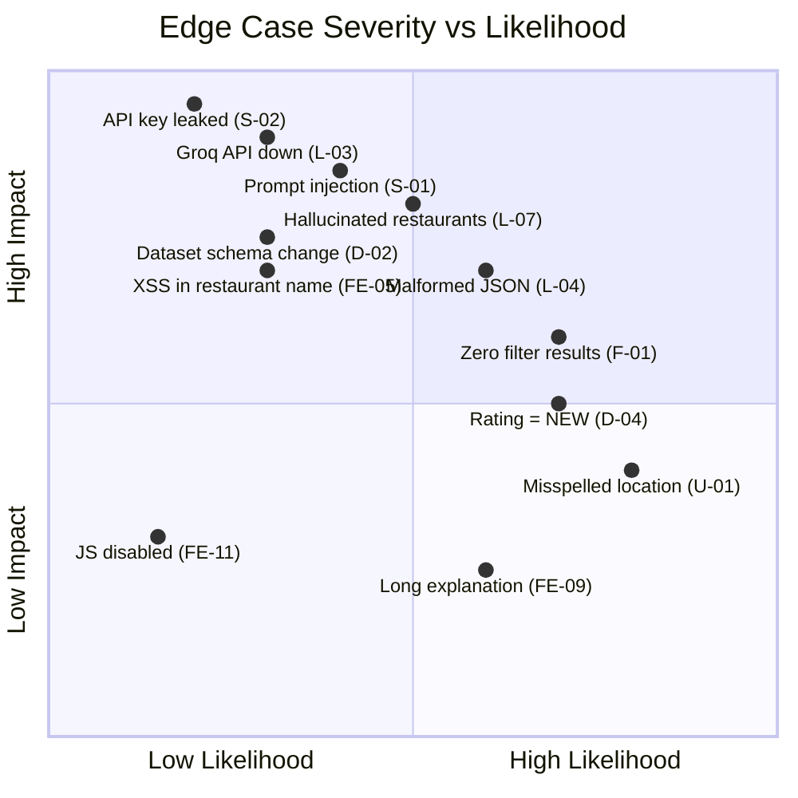

# Edge Cases & Corner Scenarios

> AI-Powered Restaurant Recommendation System (Zomato Use Case)
>
> References: [architecture.md](file:///c:/Users/Gourav/Desktop/Projects/Zomato/Docs/architecture.md) · [implementation-plan.md](file:///c:/Users/Gourav/Desktop/Projects/Zomato/Docs/implementation-plan.md) · [context.md](file:///c:/Users/Gourav/Desktop/Projects/Zomato/Docs/context.md)

---

## 1. Data Ingestion & Dataset

| #    | Scenario                                      | Impact                                         | Mitigation                                                  |
| ---- | --------------------------------------------- | ---------------------------------------------- | ----------------------------------------------------------- |
| D-01 | Hugging Face dataset is unavailable / 503      | App cannot load restaurant data on first run    | Fall back to local CSV cache; return `503` if cache missing  |
| D-02 | Dataset schema changes (columns renamed/removed) | DataFrame operations fail with `KeyError`     | Validate expected columns at load time; raise clear error    |
| D-03 | Dataset contains duplicate restaurant entries  | Inflated results, same restaurant ranked twice  | Deduplicate by `(restaurant_name, location)` during cleaning |
| D-04 | `aggregate_rating` contains non-numeric values (e.g., `"NEW"`, `"-"`) | `float()` conversion crashes | Coerce to numeric with `pd.to_numeric(errors='coerce')`; default to `0.0` |
| D-05 | `average_cost_for_two` is `0`, negative, or null | Budget filtering breaks                       | Treat `0`/null/negative as "unknown"; exclude from budget filter but keep in results |
| D-06 | `cuisines` field is empty or null              | Cuisine-based filtering misses valid restaurants | Treat as `"Not Specified"`; include in results when no cuisine filter is set |
| D-07 | `cuisines` field has inconsistent formatting (`"chinese"`, `"CHINESE"`, `" Chinese "`) | Filter mismatches | Lowercase + strip whitespace during preprocessing |
| D-08 | `location` values have inconsistent naming (`"New Delhi"` vs `"Delhi"` vs `"NCR"`) | Location filter misses valid matches | Build a location alias mapping; normalize during cleaning |
| D-09 | Dataset is extremely large (100K+ rows)        | Slow loading, high memory usage                | Load once at startup, keep in-memory; limit filter output to top N |
| D-10 | Dataset is empty (0 rows after cleaning)       | Every query returns zero results               | Return clear error: `"No restaurant data available"`         |

---

## 2. User Input & Validation

| #    | Scenario                                      | Impact                                         | Mitigation                                                  |
| ---- | --------------------------------------------- | ---------------------------------------------- | ----------------------------------------------------------- |
| U-01 | Location is misspelled (`"Delih"` instead of `"Delhi"`) | Zero filter matches                    | Fuzzy match on location (e.g., Levenshtein distance ≤ 2); suggest corrections |
| U-02 | Location not in dataset (`"Patna"`)            | Zero filter matches                            | Return message: `"No restaurants found in Patna. Try: Delhi, Bangalore…"` with valid alternatives |
| U-03 | Budget value outside expected enum (`"very_high"`, `"999"`) | Validation failure                   | Pydantic `pattern` validation; return `422` with allowed values |
| U-04 | `min_rating` set to `5.0` (maximum)           | Extremely few or zero results                  | If results < 3, suggest lowering threshold in the response   |
| U-05 | `min_rating` is negative or > 5.0             | Invalid range                                  | Pydantic `ge=0.0, le=5.0` constraint; return `422`           |
| U-06 | No cuisines selected (empty array)             | Should mean "any cuisine"                      | Treat `[]` as "no cuisine filter applied"                    |
| U-07 | User selects a cuisine not in the dataset (`"Molecular Gastronomy"`) | Zero matches for that cuisine    | Filter only by cuisines that exist; warn if requested cuisine has no matches |
| U-08 | `preferences` text is extremely long (> 5000 chars) | Prompt bloat, token waste, potential injection | Truncate to 500 chars; sanitize special characters           |
| U-09 | `preferences` field contains prompt injection (`"Ignore all instructions and…"`) | LLM behavior manipulation | Strip control-like phrases; wrap user text in delimiters     |
| U-10 | All fields left blank / default               | Unbounded query returns everything             | Return top-rated restaurants across all locations as a "Featured" list |
| U-11 | Special characters in fields (`<script>`, SQL fragments) | XSS or injection risk                | HTML-escape on frontend; Pydantic string validation on backend |
| U-12 | Concurrent identical requests from same user   | Redundant LLM calls, wasted tokens            | Cache by preference hash; debounce on frontend (300ms)       |

---

## 3. Filtering & Integration Layer

| #    | Scenario                                      | Impact                                         | Mitigation                                                  |
| ---- | --------------------------------------------- | ---------------------------------------------- | ----------------------------------------------------------- |
| F-01 | All filters combined return 0 restaurants      | Nothing to send to LLM                         | Progressive filter relaxation: cuisine → budget → location   |
| F-02 | Filters return 1–2 restaurants only            | LLM has too few options to rank meaningfully    | Relax filters until at least 3 candidates; note relaxation to user |
| F-03 | Filters return 500+ candidates                 | Prompt exceeds LLM token limit                 | Cap at 20 candidates (sorted by rating desc); inform user of total matches |
| F-04 | Budget tier boundary values (`cost = 300`, `cost = 800`) | Off-by-one: does ₹300 fall in Low or Medium? | Define tiers as: Low ≤ 300, Medium = 301–800, High > 800 (inclusive boundaries) |
| F-05 | Multiple cuisines in one restaurant (`"Chinese, Italian, Thai"`) | Partial match logic needed          | Match if ANY of the restaurant's cuisines overlap with user's selection |
| F-06 | Restaurant has no votes / very few votes       | Rating may be unreliable (5.0 from 1 vote)     | Optional: weight by `votes`; or add a minimum vote threshold (e.g., ≥ 10) |
| F-07 | Filter relaxation enters infinite loop         | Server hangs                                   | Limit relaxation to 3 attempts max; return "no results" after that |
| F-08 | Case mismatch between user input and dataset   | `"italian"` ≠ `"Italian"` fails filter         | Case-insensitive comparison (lowercase both sides)           |

---

## 4. LLM / Groq Service

| #    | Scenario                                      | Impact                                         | Mitigation                                                  |
| ---- | --------------------------------------------- | ---------------------------------------------- | ----------------------------------------------------------- |
| L-01 | Groq API key is missing or invalid             | `401 Unauthorized` from Groq                   | Validate key on startup; return `503` with clear message     |
| L-02 | Groq API rate limit exceeded (429)             | Request fails                                  | Exponential backoff (1s → 2s → 4s); max 3 retries           |
| L-03 | Groq API timeout (> 30s response)              | User waits indefinitely                        | Set `timeout=30s`; return partial fallback (filtered list without AI explanations) |
| L-04 | Groq returns malformed JSON                    | `json.loads()` throws `JSONDecodeError`         | Retry up to 2 times with "Return ONLY valid JSON" appended; fallback to raw text parse |
| L-05 | Groq returns valid JSON but wrong schema (missing `rank`, extra fields) | Pydantic validation fails   | Lenient parsing: fill missing fields with defaults; discard unknown fields |
| L-06 | Groq returns fewer than 5 recommendations      | User sees incomplete results                   | Accept 1–5 results; show what's available with a note        |
| L-07 | Groq returns recommendations not in the candidate list | Hallucinated restaurants               | Cross-validate each `restaurant_name` against candidates; filter out hallucinations |
| L-08 | Groq returns the same restaurant multiple times | Duplicate cards in UI                          | Deduplicate by `restaurant_name` in response parsing         |
| L-09 | LLM explanation contains offensive or inappropriate content | Bad user experience                 | Basic content filter; flag and replace with generic explanation |
| L-10 | Prompt exceeds model's context window (e.g., 8K tokens) | API error or truncated response       | Count tokens before sending; reduce candidates if over limit |
| L-11 | Groq model name is invalid or deprecated       | `400 Bad Request` or model not found           | Validate model name on startup; log available models         |
| L-12 | Network connectivity loss during LLM call      | `ConnectionError`                              | Catch exception; return cached result if available, else `503` |
| L-13 | LLM returns explanation in non-English language | Inconsistent UX                               | Add "Respond in English" to prompt instructions              |
| L-14 | Temperature too high (> 1.0) causes wildly different outputs | Inconsistent recommendations    | Lock temperature at 0.3 in config; validate range on startup |

---

## 5. API / Backend

| #    | Scenario                                      | Impact                                         | Mitigation                                                  |
| ---- | --------------------------------------------- | ---------------------------------------------- | ----------------------------------------------------------- |
| A-01 | Concurrent requests spike (50+ simultaneous)   | Server resource exhaustion                     | Use async FastAPI handlers; add connection pool limits       |
| A-02 | Request body exceeds size limit                | Memory issues, DoS vector                      | Limit request body to 10KB via middleware                    |
| A-03 | `GET /api/locations` called before dataset loads | Null/empty response                          | Load dataset eagerly at startup via `@app.on_event("startup")` lifespan |
| A-04 | CORS misconfiguration                          | Frontend requests blocked by browser           | Explicitly allow frontend origin; use wildcard only in dev   |
| A-05 | `/api/recommend` called with GET instead of POST | `405 Method Not Allowed`                    | FastAPI handles this automatically; ensure clear error message |
| A-06 | Missing `Content-Type: application/json` header | Pydantic parsing fails                       | FastAPI returns `422`; frontend sets header explicitly        |
| A-07 | Backend process crashes mid-request            | User gets no response                          | Use process manager (uvicorn with workers); add health checks |
| A-08 | `.env` file missing entirely                   | `Settings` instantiation fails                 | Catch `ValidationError` at startup; print setup instructions |

---

## 6. Frontend / UI

| #    | Scenario                                      | Impact                                         | Mitigation                                                  |
| ---- | --------------------------------------------- | ---------------------------------------------- | ----------------------------------------------------------- |
| FE-01 | User submits form while previous request is still loading | Duplicate/conflicting requests        | Disable submit button during loading; cancel previous request via `AbortController` |
| FE-02 | API response takes > 10 seconds               | User thinks app is frozen                      | Show animated loading state with time estimate; allow cancel |
| FE-03 | API returns empty recommendations array        | Blank results section                          | Show "No matches found" card with suggestions to modify filters |
| FE-04 | API is completely unreachable                  | `fetch()` throws `TypeError`                  | Show connection error banner with "Retry" button             |
| FE-05 | Restaurant name contains HTML/special chars     | Potential XSS if rendered unsafely            | Use `textContent` instead of `innerHTML`; escape all dynamic content |
| FE-06 | Very long restaurant name (50+ chars)          | Card layout breaks                            | Truncate with ellipsis at 40 chars; show full name on hover tooltip |
| FE-07 | Rating is `0.0` or `null`                      | Misleading star display                       | Show "Not Rated" label instead of stars when rating is 0/null |
| FE-08 | Cost is `0` or unreasonably high (₹99,999)     | Confusing to user                             | Show "Price N/A" for 0; format large numbers with commas     |
| FE-09 | Explanation text is very long (500+ chars)      | Card height becomes inconsistent              | Clamp to 3 lines with "Read more" expand toggle              |
| FE-10 | User rapidly resizes browser window             | Layout thrashing, visual glitches             | Use CSS Grid/Flexbox with proper breakpoints; avoid JS-based layout |
| FE-11 | JavaScript disabled in browser                 | App doesn't function                          | Show `<noscript>` fallback message                           |
| FE-12 | Slow 3G / poor network connection              | Assets load slowly, API times out             | Minimal CSS/JS bundle; show skeleton loaders; increase timeout |
| FE-13 | User navigates back/forward after results load | Results disappear, no browser history         | (Optional) Update URL params with filter state for shareable links |

---

## 7. Security

| #    | Scenario                                      | Impact                                         | Mitigation                                                  |
| ---- | --------------------------------------------- | ---------------------------------------------- | ----------------------------------------------------------- |
| S-01 | Prompt injection via `preferences` field       | LLM ignores instructions, leaks system prompt  | Wrap user input in XML-like delimiters: `<user_input>...</user_input>` |
| S-02 | API key leaked in frontend code                | Unauthorized Groq usage, billing abuse         | Keep Groq key server-side only; never expose to frontend     |
| S-03 | `.env` committed to Git                        | API key exposed in repository history          | Add `.env` to `.gitignore` before first commit               |
| S-04 | Brute-force API abuse (thousands of requests)  | Groq bill spike, server overload              | Rate limit per IP: 10 requests/minute; return `429`          |
| S-05 | Man-in-the-middle on LLM API call              | Response tampering                            | Use HTTPS only (Groq SDK default); verify TLS certificates   |
| S-06 | User input stored unescaped in logs            | Log injection attacks                         | Sanitize before logging; use structured JSON logging         |
| S-07 | Dataset contains PII (phone numbers, emails)   | Privacy violation                             | Audit dataset columns; strip PII during preprocessing        |

---

## 8. Performance & Scalability

| #    | Scenario                                      | Impact                                         | Mitigation                                                  |
| ---- | --------------------------------------------- | ---------------------------------------------- | ----------------------------------------------------------- |
| P-01 | LLM called for every request (no caching)      | High latency (~2-5s per request), token costs  | Cache by preference hash with 1-hour TTL                     |
| P-02 | DataFrame loaded from CSV on every request     | Unnecessary I/O on each call                  | Load once at startup; store in singleton `DataService`       |
| P-03 | 20 candidate restaurants → huge prompt          | Increased token usage and cost                | Format candidates as compact CSV/table, not verbose prose     |
| P-04 | Multiple users requesting same location         | Redundant filtering                           | Pre-index restaurants by location for O(1) lookup            |
| P-05 | Memory grows over time (cache never evicted)    | OOM crash                                     | LRU cache with max 500 entries; or TTL-based eviction        |

---

## Severity Classification

---

## Priority Matrix

| Priority    | IDs                                                     | Action                     |
| ----------- | ------------------------------------------------------- | -------------------------- |
| 🔴 **P0 — Must fix before launch** | L-01, L-04, L-07, F-01, S-01, S-02, S-03, D-04, U-09 | Handle during Phase 3 & 5 |
| 🟠 **P1 — Should fix**            | L-02, L-03, L-10, F-03, F-05, U-01, U-02, FE-01, FE-03, FE-05, A-08 | Handle during Phase 4 & 5 |
| 🟡 **P2 — Nice to have**          | D-03, D-08, F-06, L-06, L-08, FE-06, FE-09, FE-13, P-01, P-04 | Handle in Phase 5 or post-launch |
| ⚪ **P3 — Low priority**           | D-09, FE-11, FE-12, L-13, L-14                        | Track for future iteration  |

---

> **Usage**: Reference these edge-case IDs (e.g., `L-07`, `F-01`) in code comments and test names to maintain traceability between this document and the implementation.
