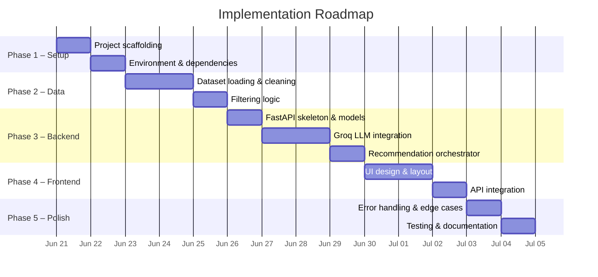
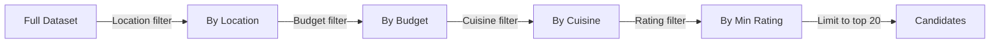
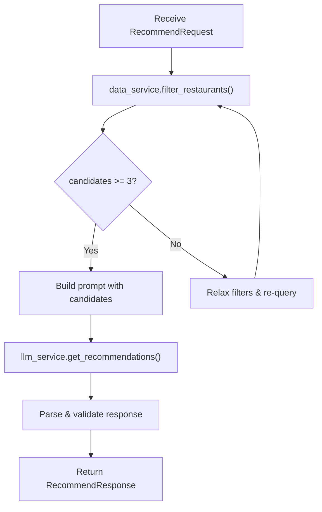
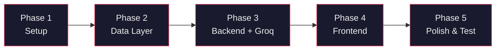

# Implementation Plan — AI-Powered Restaurant Recommendation System

> Based on [architecture.md](file:///c:/Users/Gourav/Desktop/Projects/Zomato/Docs/architecture.md) and [context.md](file:///c:/Users/Gourav/Desktop/Projects/Zomato/Docs/context.md)

---

## Overview

This plan breaks the project into **5 phases**, ordered by dependency. Each phase produces a testable, working increment so progress is verifiable at every stage.



---

## Phase 1 — Project Setup & Environment

**Goal**: Scaffold the project structure, install all dependencies, and configure environment variables.

### Tasks

| #   | Task                                       | File(s)                                     | Status |
| --- | ------------------------------------------ | ------------------------------------------- | ------ |
| 1.1 | Create project directory structure         | See directory tree below                    | ☐      |
| 1.2 | Initialize Python virtual environment      | `backend/`                                  | ☐      |
| 1.3 | Create `requirements.txt`                  | `backend/requirements.txt`                  | ☐      |
| 1.4 | Create `.env` with Groq API key placeholder| `backend/.env`                              | ☐      |
| 1.5 | Create `config.py` for settings            | `backend/config.py`                         | ☐      |
| 1.6 | Create `.gitignore`                        | `.gitignore`                                | ☐      |
| 1.7 | Create `README.md` with setup instructions | `README.md`                                 | ☐      |

### Directory Structure to Create

```
Zomato/
├── backend/
│   ├── main.py
│   ├── config.py
│   ├── models/
│   │   ├── __init__.py
│   │   ├── schemas.py
│   │   └── restaurant.py
│   ├── services/
│   │   ├── __init__.py
│   │   ├── data_service.py
│   │   ├── llm_service.py
│   │   └── recommendation_service.py
│   ├── prompts/
│   │   ├── __init__.py
│   │   └── recommend.py
│   ├── data/
│   ├── requirements.txt
│   └── .env
├── frontend/
│   ├── index.html
│   ├── css/
│   │   └── index.css
│   ├── js/
│   │   ├── app.js
│   │   ├── api.js
│   │   └── components/
│   │       ├── PreferenceForm.js
│   │       └── RecommendationCard.js
│   └── assets/
│       └── images/
├── tests/
│   ├── test_data_service.py
│   ├── test_llm_service.py
│   └── test_api.py
├── Docs/
├── .gitignore
└── README.md
```

### Dependencies (`requirements.txt`)

```
fastapi>=0.111.0
uvicorn[standard]>=0.30.0
groq>=0.9.0
pandas>=2.2.0
datasets>=2.20.0
python-dotenv>=1.0.0
pydantic>=2.7.0
httpx>=0.27.0
```

### Environment Config (`backend/.env`)

```env
GROQ_API_KEY=your_groq_api_key_here
GROQ_MODEL=llama-3.3-70b-versatile
LLM_TEMPERATURE=0.3
LLM_MAX_TOKENS=2000
```

### `config.py` Outline

```python
from pydantic_settings import BaseSettings

class Settings(BaseSettings):
    groq_api_key: str
    groq_model: str = "llama-3.3-70b-versatile"
    llm_temperature: float = 0.3
    llm_max_tokens: int = 2000

    class Config:
        env_file = ".env"
```

### ✅ Phase 1 Exit Criteria

- [ ] `pip install -r requirements.txt` completes without errors
- [ ] `python -c "from config import Settings; s = Settings(); print(s.groq_model)"` prints model name
- [ ] Project directory matches the planned structure

---

## Phase 2 — Data Layer (Ingestion & Filtering)

**Goal**: Load the Zomato dataset from Hugging Face, preprocess it, and build a filtering engine.

### Tasks

| #   | Task                                               | File(s)                         | Status |
| --- | -------------------------------------------------- | ------------------------------- | ------ |
| 2.1 | Load dataset from Hugging Face                     | `services/data_service.py`      | ☐      |
| 2.2 | Clean & normalize data (nulls, strings, types)     | `services/data_service.py`      | ☐      |
| 2.3 | Define budget tier mapping                         | `services/data_service.py`      | ☐      |
| 2.4 | Implement `filter_restaurants(preferences)` method | `services/data_service.py`      | ☐      |
| 2.5 | Cache dataset locally as CSV                       | `data/zomato_dataset.csv`       | ☐      |
| 2.6 | Define `Restaurant` data model                     | `models/restaurant.py`          | ☐      |
| 2.7 | Write unit tests for data service                  | `tests/test_data_service.py`    | ☐      |

### Implementation Details

#### 2.1–2.2 Dataset Loading & Cleaning

```python
# services/data_service.py
from datasets import load_dataset
import pandas as pd

class DataService:
    def __init__(self):
        self.df = self._load_and_clean()

    def _load_and_clean(self) -> pd.DataFrame:
        # 1. Check for local cache first
        # 2. If not cached, download from Hugging Face
        # 3. Clean: drop nulls in critical columns, normalize cuisine strings
        # 4. Parse ratings to float, costs to int
        # 5. Save to local CSV cache
        ...
```

#### 2.3 Budget Tier Mapping

| Tier       | Cost for Two (₹)  |
| ---------- | ------------------ |
| **Low**    | ≤ 300              |
| **Medium** | 301 – 800          |
| **High**   | > 800              |

#### 2.4 Filtering Logic

The `filter_restaurants()` method applies filters in this order:



**Filter relaxation strategy** (if candidates < 3):
1. First relaxation: broaden cuisine filter (any cuisine)
2. Second relaxation: widen budget tier by ±1 level
3. Third relaxation: expand to nearby locations (if mapping available)

### ✅ Phase 2 Exit Criteria

- [ ] Dataset loads successfully (from Hugging Face or local cache)
- [ ] `filter_restaurants({"location": "Delhi", "budget": "medium"})` returns a valid DataFrame
- [ ] All unit tests in `test_data_service.py` pass
- [ ] Edge case: empty filter result triggers relaxation and returns results

---

## Phase 3 — Backend API & LLM Integration

**Goal**: Build the FastAPI server, integrate Groq for LLM-powered ranking, and wire up the full recommendation pipeline.

### Tasks

| #   | Task                                               | File(s)                              | Status |
| --- | -------------------------------------------------- | ------------------------------------ | ------ |
| 3.1 | Define Pydantic request/response schemas           | `models/schemas.py`                  | ☐      |
| 3.2 | Create FastAPI app with CORS & health endpoint     | `main.py`                            | ☐      |
| 3.3 | Implement `GET /api/locations`                     | `main.py`                            | ☐      |
| 3.4 | Implement `GET /api/cuisines`                      | `main.py`                            | ☐      |
| 3.5 | Design LLM prompt template                        | `prompts/recommend.py`               | ☐      |
| 3.6 | Implement Groq LLM service                        | `services/llm_service.py`            | ☐      |
| 3.7 | Implement recommendation orchestrator              | `services/recommendation_service.py` | ☐      |
| 3.8 | Implement `POST /api/recommend`                    | `main.py`                            | ☐      |
| 3.9 | Add error handling & retry logic                   | `services/llm_service.py`            | ☐      |
| 3.10| Write API integration tests                        | `tests/test_api.py`                  | ☐      |

### 3.1 Pydantic Schemas

```python
# models/schemas.py
from pydantic import BaseModel, Field

class RecommendRequest(BaseModel):
    location: str
    budget: str = Field(pattern="^(low|medium|high)$")
    cuisines: list[str] = []
    min_rating: float = Field(default=0.0, ge=0.0, le=5.0)
    preferences: str = ""

class Recommendation(BaseModel):
    rank: int
    restaurant_name: str
    cuisines: str
    location: str
    aggregate_rating: float
    average_cost_for_two: int
    explanation: str

class RecommendResponse(BaseModel):
    recommendations: list[Recommendation]
    summary: str
    total_candidates_filtered: int
```

### 3.5 Prompt Template

```python
# prompts/recommend.py
RECOMMEND_PROMPT = """
You are an expert restaurant recommendation assistant.

## User Preferences
- Location: {location}
- Budget: {budget_label} (≤ ₹{budget_max} for two)
- Preferred Cuisines: {cuisines}
- Minimum Rating: {min_rating}
- Additional: {preferences}

## Candidate Restaurants
{formatted_table}

## Instructions
1. Rank the top 5 restaurants that best match the user's preferences.
2. For each, provide a short, human-friendly explanation of WHY it is a good match.
3. If none of the candidates are a great fit, say so honestly.
4. Return ONLY a JSON array with keys: rank, restaurant_name, cuisines,
   location, aggregate_rating, average_cost_for_two, explanation.
"""
```

### 3.6 Groq LLM Service

```python
# services/llm_service.py
from groq import Groq

class LLMService:
    def __init__(self, settings):
        self.client = Groq(api_key=settings.groq_api_key)
        self.model = settings.groq_model
        self.temperature = settings.llm_temperature
        self.max_tokens = settings.llm_max_tokens

    async def get_recommendations(self, prompt: str) -> list[dict]:
        # 1. Call Groq chat completions API
        # 2. Parse JSON from response
        # 3. Retry up to 2 times on malformed JSON
        # 4. Return list of recommendation dicts
        ...
```

### 3.7 Orchestrator Flow



### ✅ Phase 3 Exit Criteria

- [ ] `GET /api/health` returns `{"status": "ok", "llm_connected": true}`
- [ ] `GET /api/locations` and `GET /api/cuisines` return valid lists
- [ ] `POST /api/recommend` with sample input returns ranked recommendations with explanations
- [ ] Malformed LLM response triggers retry and eventual graceful fallback
- [ ] All tests in `test_api.py` pass

---

## Phase 4 — Frontend (UI & API Integration)

**Goal**: Build a polished, responsive web interface for collecting preferences and displaying recommendations.

### Tasks

| #   | Task                                               | File(s)                              | Status |
| --- | -------------------------------------------------- | ------------------------------------ | ------ |
| 4.1 | Design global CSS tokens & dark theme              | `css/index.css`                      | ☐      |
| 4.2 | Build HTML page structure                          | `index.html`                         | ☐      |
| 4.3 | Build Preference Form component                    | `js/components/PreferenceForm.js`    | ☐      |
| 4.4 | Build Recommendation Card component                | `js/components/RecommendationCard.js`| ☐      |
| 4.5 | Implement API client module                        | `js/api.js`                          | ☐      |
| 4.6 | Wire up main application logic                     | `js/app.js`                          | ☐      |
| 4.7 | Add loading states & micro-animations              | `css/index.css`, `js/app.js`         | ☐      |
| 4.8 | Populate dropdowns from API (`/locations`, `/cuisines`) | `js/app.js`                     | ☐      |
| 4.9 | Make UI fully responsive (mobile, tablet, desktop) | `css/index.css`                      | ☐      |

### 4.1 Design System — CSS Tokens

```css
/* css/index.css — Design tokens */
:root {
    /* Colors — Dark theme */
    --bg-primary:    hsl(220, 20%, 8%);
    --bg-card:       hsl(220, 18%, 13%);
    --bg-glass:      hsla(220, 18%, 16%, 0.6);
    --accent:        hsl(10, 85%, 55%);   /* Zomato-inspired red */
    --accent-glow:   hsla(10, 85%, 55%, 0.3);
    --text-primary:  hsl(0, 0%, 95%);
    --text-secondary:hsl(220, 10%, 60%);
    --border:        hsl(220, 15%, 20%);

    /* Typography */
    --font-main:     'Inter', sans-serif;
    --font-display:  'Outfit', sans-serif;

    /* Spacing & Radius */
    --radius-md:     12px;
    --radius-lg:     20px;
    --shadow-card:   0 8px 32px hsla(0, 0%, 0%, 0.4);
}
```

### 4.2 Page Layout

```
┌──────────────────────────────────────────────────┐
│  🍽️ Zomato AI Recommender — Hero / Header        │
├──────────────────────────────────────────────────┤
│                                                  │
│  ┌────────────────────────────────────────────┐  │
│  │  📋 Preference Form (glassmorphism card)    │  │
│  │  ┌──────────┐ ┌──────────┐ ┌────────────┐ │  │
│  │  │ Location │ │ Budget   │ │ Cuisine    │ │  │
│  │  └──────────┘ └──────────┘ └────────────┘ │  │
│  │  ┌──────────┐ ┌──────────────────────────┐ │  │
│  │  │ Rating   │ │ Additional Preferences   │ │  │
│  │  └──────────┘ └──────────────────────────┘ │  │
│  │            [ 🔍 Get Recommendations ]       │  │
│  └────────────────────────────────────────────┘  │
│                                                  │
├──────────────────────────────────────────────────┤
│  Results Section                                 │
│  ┌──────────┐ ┌──────────┐ ┌──────────┐         │
│  │ Card #1  │ │ Card #2  │ │ Card #3  │  ...    │
│  │ Name     │ │ Name     │ │ Name     │         │
│  │ Cuisine  │ │ Cuisine  │ │ Cuisine  │         │
│  │ ★ 4.5   │ │ ★ 4.3   │ │ ★ 4.1   │         │
│  │ ₹800/2  │ │ ₹600/2  │ │ ₹450/2  │         │
│  │ AI Reason│ │ AI Reason│ │ AI Reason│         │
│  └──────────┘ └──────────┘ └──────────┘         │
│                                                  │
│  💬 AI Summary                                   │
└──────────────────────────────────────────────────┘
```

### 4.4 Recommendation Card Fields

Each card displays:

| Element               | Visual Treatment                           |
| --------------------- | ------------------------------------------ |
| Rank badge            | Circular gradient badge (top-left corner)   |
| Restaurant name       | `--font-display`, 1.25rem, bold             |
| Cuisine tags          | Pill-shaped badges with subtle bg           |
| Rating                | Star icon + number, accent color            |
| Cost for two          | ₹ icon + formatted number                  |
| AI explanation        | Italicized paragraph, lighter text          |
| Delivery / Booking    | Small icons if available                    |

### ✅ Phase 4 Exit Criteria

- [ ] Page loads with dark theme and all form fields functional
- [ ] Dropdowns populate dynamically from backend (`/locations`, `/cuisines`)
- [ ] Submitting the form shows a loading animation
- [ ] Recommendation cards render with all fields (name, cuisine, rating, cost, explanation)
- [ ] UI is responsive on mobile (≤480px), tablet (≤768px), and desktop
- [ ] Smooth hover effects and transitions on cards and buttons

---

## Phase 5 — Polish, Testing & Documentation

**Goal**: Harden the system with error handling, add comprehensive tests, optimize performance, and finalize documentation.

### Tasks

| #   | Task                                               | File(s)                              | Status |
| --- | -------------------------------------------------- | ------------------------------------ | ------ |
| 5.1 | Add frontend error states (no results, API down)   | `js/app.js`, `css/index.css`         | ☐      |
| 5.2 | Add input validation in frontend                   | `js/components/PreferenceForm.js`    | ☐      |
| 5.3 | Implement rate limiting on backend                 | `main.py`                            | ☐      |
| 5.4 | Add prompt injection sanitization                  | `services/llm_service.py`           | ☐      |
| 5.5 | Implement response caching (by preference hash)    | `services/recommendation_service.py` | ☐      |
| 5.6 | Write full test suite                              | `tests/`                             | ☐      |
| 5.7 | Performance audit (loading times, token usage)     | —                                    | ☐      |
| 5.8 | Update `README.md` with full setup & usage guide   | `README.md`                          | ☐      |
| 5.9 | Final UI polish pass (animations, typography)      | `css/index.css`                      | ☐      |
| 5.10| End-to-end walkthrough & demo                      | —                                    | ☐      |

### 5.1 Error States

| Scenario               | Frontend Behavior                                  |
| ---------------------- | -------------------------------------------------- |
| No recommendations     | Show friendly "No matches" card with suggestions to broaden filters |
| API server unreachable | Show connection error banner with retry button      |
| LLM timeout            | Show "Taking longer than expected…" with spinner    |
| Invalid form input     | Inline validation messages below each field         |

### 5.5 Caching Strategy

```python
# Simple in-memory cache with TTL
import hashlib, time

class RecommendationCache:
    def __init__(self, ttl_seconds=3600):
        self._cache = {}
        self._ttl = ttl_seconds

    def _key(self, preferences: dict) -> str:
        return hashlib.sha256(str(sorted(preferences.items())).encode()).hexdigest()

    def get(self, preferences: dict):
        key = self._key(preferences)
        if key in self._cache:
            entry, ts = self._cache[key]
            if time.time() - ts < self._ttl:
                return entry
            del self._cache[key]
        return None

    def set(self, preferences: dict, result):
        self._cache[self._key(preferences)] = (result, time.time())
```

### 5.6 Test Matrix

| Test File               | Scope              | Key Test Cases                                      |
| ----------------------- | ------------------ | --------------------------------------------------- |
| `test_data_service.py`  | Unit               | Load dataset, filter by location, filter by budget, empty result, relaxation |
| `test_llm_service.py`   | Unit (mocked Groq) | Valid response parsing, malformed JSON retry, timeout handling |
| `test_api.py`           | Integration        | All endpoints, validation errors (422), CORS headers |

### ✅ Phase 5 Exit Criteria

- [ ] All error states display correctly in the UI
- [ ] Full test suite passes: `pytest tests/ -v`
- [ ] No unhandled exceptions on edge-case inputs
- [ ] `README.md` has complete setup, run, and usage instructions
- [ ] Demo walkthrough completed end-to-end

---

## Summary — Phase Dependencies



| Phase | Focus                     | Key Deliverable                                    |
| ----- | ------------------------- | -------------------------------------------------- |
| **1** | Project Setup             | Scaffolded project with all dependencies installed  |
| **2** | Data Layer                | Working dataset loader + filter engine with tests   |
| **3** | Backend + Groq LLM       | Fully functional API returning AI recommendations   |
| **4** | Frontend UI               | Polished, responsive web interface                  |
| **5** | Polish, Testing & Docs    | Production-ready app with tests and documentation   |

---

> **Ready to begin?** Start with **Phase 1** — project scaffolding and environment setup.
